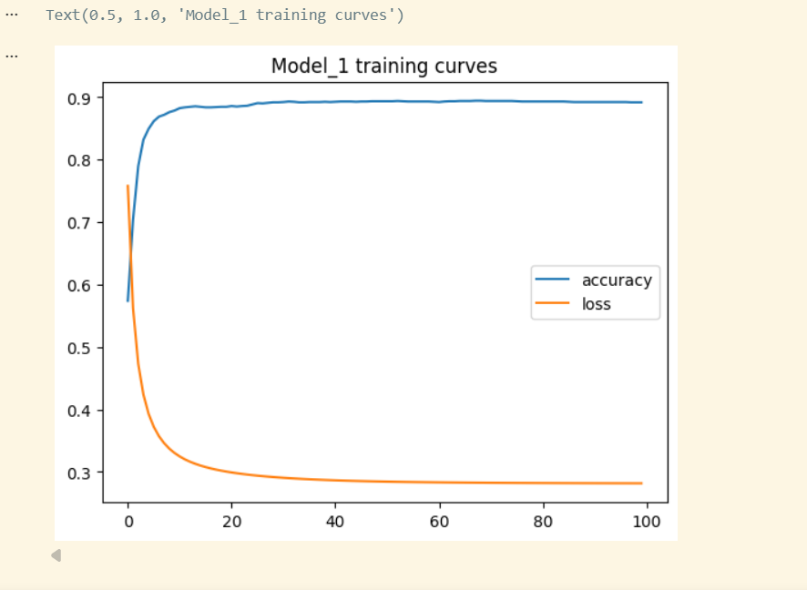

## Employee Attrition Classification using TensorFlow

### Project Overview

This project uses TensorFlow and Neural Networks to predict employee attrition. Employee attrition refers to whether an employee leaves or stays with a company. Different model configurations were evaluated by modifying epochs, hidden layers, neurons, learning rate, and activation functions.

---

### Dataset

* employee_attrition.csv
* Target Variable: Attrition

---

### Tools and Libraries

* Python
* VS Code
* Jupyter Notebook
  

---

### Project Workflow

1. Data Loading and Exploration
2. Data Preprocessing
3. Feature Scaling using StandardScaler
4. Train-Test Split
5. Neural Network Development
6. Hyperparameter Evaluation
7. Model Training and Testing
8. Performance Analysis

---

### Best Model Hyperparameters

| Hyperparameter    | Value               |
| ----------------- | ------------------- |
| Hidden Layers     | 1                   |
| Hidden Neurons    | 3                   |
| Output Activation | Sigmoid             |
| Optimizer         | SGD                 |
| Learning Rate     | 0.01                |
| Loss Function     | Binary Crossentropy |
| Epochs            | 100                 |
| Batch Size        | 32                  |
| Accuracy          | 0.8941              |

### Training Curves

The graph below shows the training accuracy and loss of the best-performing model.

---

### Results

Several neural network configurations were tested. The highest accuracy achieved was 89.41% using a Sigmoid activation function, SGD optimizer, learning rate of 0.01, batch size of 32, and 100 training epochs.

---

#### Author

Zainularab Zarabi

Machine Learning 

